# 腦腫瘤偵測 — 資料集 · 模型 · 評估報告

> IDH 突變偵測與膠質瘤分割管線（Brain Tumor MRI / CT）
> 涵蓋 **Classification（分類）** 與 **Segmentation（分割）** 兩大任務，附推論結果圖（成功 + 失敗案例）。
> 產出日期：2026-06-04 ／ 分支：`develop`

---

## 目錄
1. [資料集 Datasets](#1-資料集-datasets)
2. [模型 Models](#2-模型-models)
3. [評估指標 Evaluation Metrics](#3-評估指標-evaluation-metrics)
4. [推論結果圖 — Classification](#4-推論結果圖--classification)
5. [推論結果圖 — Segmentation](#5-推論結果圖--segmentation)
6. [結論與已知限制](#6-結論與已知限制)

---

## 1. 資料集 Datasets

| 資料集 | 任務 | 模態 | 規模 | 標註 |
|--------|------|------|------|------|
| **Kaggle Brain Tumor (CT + MRI)** | 分類（腫瘤 / 健康） | CT scan、MRI（2D 影像） | CT 4,618（Tumor 2,318 / Healthy 2,300）＋ MRI 5,000（Tumor 3,000 / Healthy 2,000） | 影像級二元標籤 |
| **BraTS-TCGA-LGG** | 分割 + IDH 分類 | 4 模態 NIfTI（FLAIR / T1 / T1Gd / T2） | 65 cases（train 45 / val 10 / test 10） | 體素級腫瘤遮罩 + IDH 標籤 |
| **TCGA-GBM + TCGA-LGG（分子）** | IDH 分類（RNA-seq / 甲基化） | 基因表現 log2(TPM+1) + 甲基化 | pooled 880 患者（759 具表現資料；WT 442 / Mut 438） | 公開 MAF 之 IDH1/IDH2 missense |

**資料契約重點**
- 影像 manifest：`artifacts/manifest.json`，每筆含 `case_id`、`modalities`、`mask_path`、`idh_label`（0=wildtype、1=mutant）。
- 分割目標：whole tumor（GT 遮罩 BraTS 標籤 `{1,2,4}` 二值化為 >0）。
- IDH 影像分類輸入：3-channel slice（flair / t1Gd / t2），per-volume z-score（非 ImageNet 正規化）。
- 分子表現矩陣 index 為去版本號 base ENSG，值為 `log2(TPM+1)`；特徵選擇為 fold-aware 的 `top-K variance ∪ 先驗 panel`。

---

## 2. 模型 Models

| 任務 | 模型 | 架構重點 |
|------|------|----------|
| CT/MRI 腫瘤分類 | **MobileNetV3-Small** | ImageNet 預訓練、3-channel stem、GradCAM 可視化 |
| 膠質瘤分割（2D，legacy） | **U-Net 2D** | 4-channel 輸入 → 1-channel 遮罩，Focal + Dice loss |
| 膠質瘤分割（3D，自訓） | **MONAI SegResNet 3D** | sliding-window + DiceCE，較 2D +0.15 Dice 且 std 減半 |
| 膠質瘤分割（3D，**生產推薦**） | **MONAI Model Zoo `brats_mri_segmentation`** | 在完整 BraTS（~500 cases）預訓練、zero-shot 即勝過自訓模型 |
| IDH 分類（2D） | **MobileNetV3-Large** | ROI crop、校準閾值 0.876（Youden's J） |
| IDH 分類（3D，**生產推薦**） | **MONAI DenseNet121 3D** | GT-mask ROI crop + bbox jitter，閾值 0.13（val macro-F1 選出） |
| 分子 IDH 分類 | **Logistic / LightGBM / MLP** | pooled-cohort；多體學以 per-modality late fusion |
| 腫瘤偵測 | **YOLOv8n / YOLO11n / YOLO11s** | 偵測框，資料量為主要瓶頸 |

**生產管線（推薦）**：`infer-monai-zoo` = Model Zoo bundle 分割（zero-shot Dice 0.926）→ 3D DenseNet121（jitter 訓練）IDH 分類。

---

## 3. 評估指標 Evaluation Metrics

| 模型 | 指標 | 數值 |
|------|------|------|
| CT/MRI 分類（MobileNetV3-Small） | Accuracy / AUC | **96.4%** / **0.993** |
| 分割 U-Net 2D（TCGA-LGG） | Dice | 0.760 ± 0.090（test）；val best 0.806 |
| 分割 SegResNet 3D（TCGA-LGG，自訓） | Dice | **0.910 ± 0.036**（test, 10 cases）；val best 0.918 |
| 分割 MONAI Model Zoo bundle（zero-shot） | Dice | **0.926 ± 0.031**（test, WT channel）— 生產推薦 |
| IDH 分類 MobileNetV3-Large 2D | AUC（case） | 0.875（single-split）；5-fold CV 0.764 ± 0.076 |
| IDH 分類 DenseNet121 3D（GT-mask ROI） | AUC（case） | 5-fold CV **0.916 ± 0.073**（+0.15 vs 2D） |
| IDH 端到端（預測遮罩，閾值 0.13，test 10 cases） | Acc / AUC / macroF1 | **0.80** / **0.75** / 0.44 |
| YOLO 偵測（best） | mAP50 | 0.497（yolo11s） |
| 分子 IDH（LightGBM, RNA-seq pooled） | AUC | pooled 5-fold CV **0.992 ± 0.009** |
| 分子 IDH（RNA-seq + methylation 多體學） | AUC | pooled 5-fold CV best **0.993 ± 0.007**（MLP）；GBM 少數類 AUPRC best **0.9502**（per-modality late fusion） |

評估圖（由 eval 腳本產生）：

| CT/MRI 分類 ROC | CT/MRI 分類 混淆矩陣 |
|---|---|
| 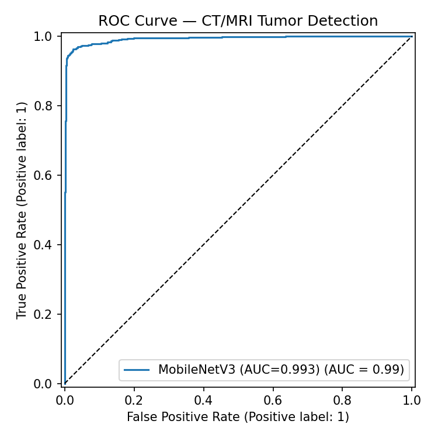 | 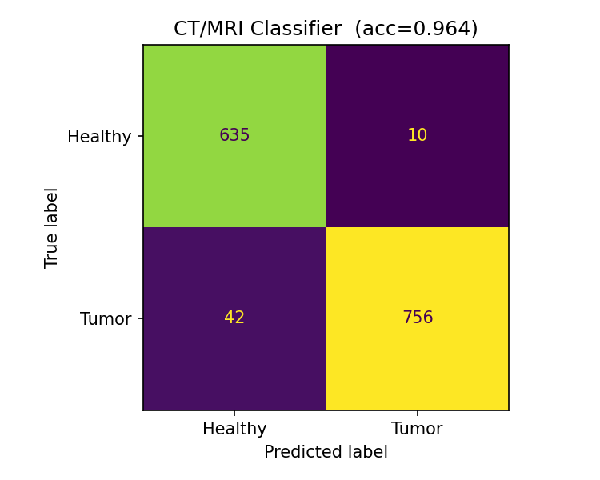 |

| 分割 3D Dice 分布 | IDH 端到端 ROC（val） | IDH 端到端 混淆矩陣（val） |
|---|---|---|
| 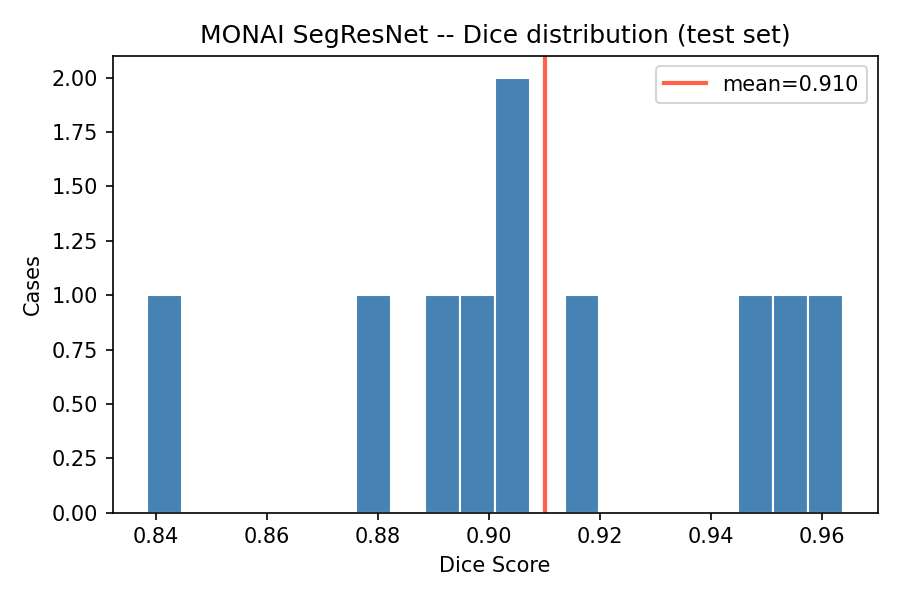 | 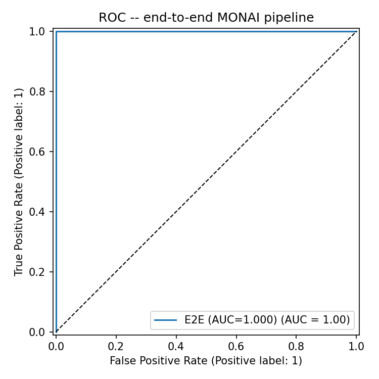 | 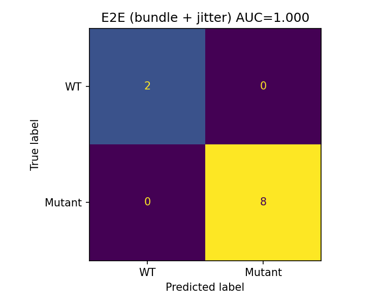 |

| 分子 IDH ROC（多體學） | 分子 IDH 校準曲線 |
|---|---|
| 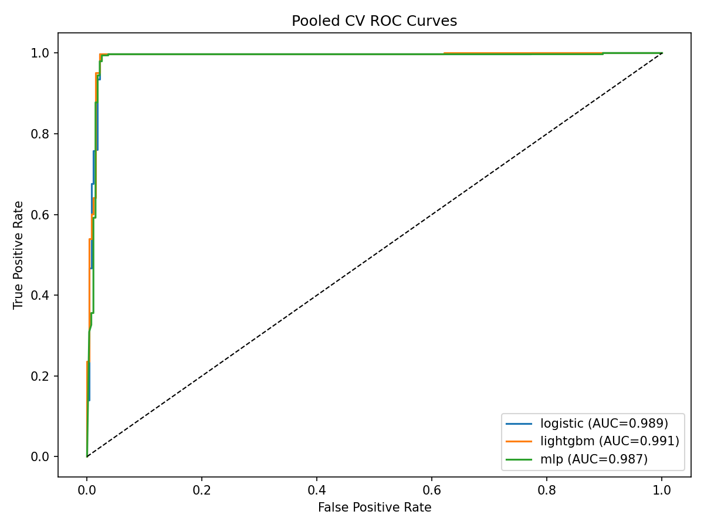 | 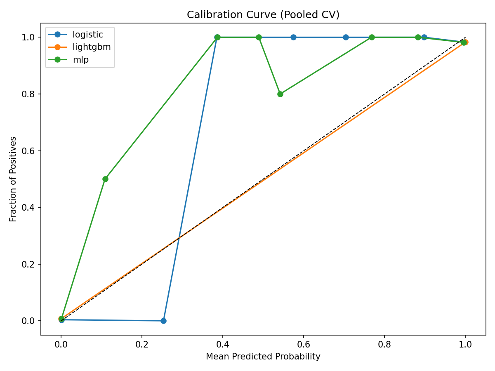 |

---

## 4. 推論結果圖 — Classification

### CT/MRI 腫瘤分類（MobileNetV3-Small）— 成功 vs 失敗

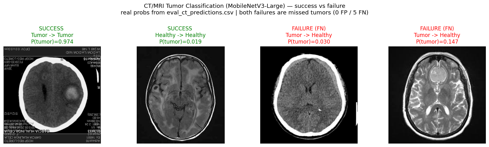

> 綠色標題 = 預測正確；紅色標題 = 預測錯誤。閾值 0.5。整體測試集 Accuracy 96.4%（1,443 張中 52 張錯誤）。

**8-case 推論藝廊（CT + MRI 各模態 × TP / TN / FP / FN）**

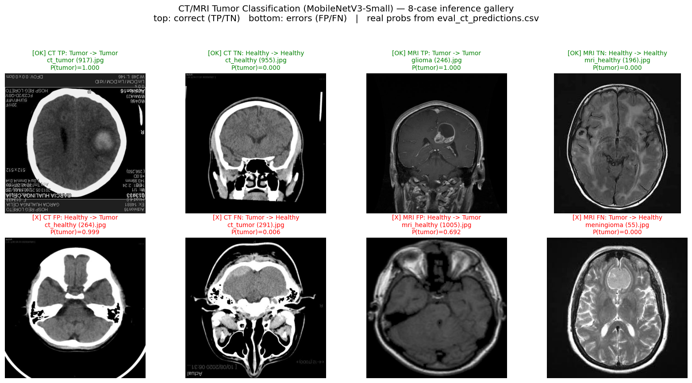

> 上排為判讀正確（TP / TN），下排為錯誤（FP / FN），兩種模態（CT、MRI）皆涵蓋。**所有 P(tumor) 直接取自 `outputs/eval_ct_predictions.csv`**，即評估當下模型實際輸出，非事後重算。
>
> | 面板 | 模態 | 影像 | 真實 | 預測 | P(tumor) | 觀察 |
> |------|------|------|------|------|----------|------|
> | TP | CT | `ct_tumor (917)` | Tumor | Tumor | 1.000 | 高信心正確 |
> | TN | CT | `ct_healthy (955)` | Healthy | Healthy | 0.000 | 健康腦完美排除 |
> | TP | MRI | `glioma (246)` | Tumor | Tumor | 1.000 | 膠質瘤強化清晰 |
> | TN | MRI | `mri_healthy (196)` | Healthy | Healthy | 0.000 | 高信心正確 |
> | FP | CT | `ct_healthy (264)` | Healthy | Tumor | 0.999 | 亮區/偽影誤判為強化 |
> | FN | CT | `ct_tumor (291)` | Tumor | Healthy | 0.006 | 對比微弱、高信心漏判 |
> | FP | MRI | `mri_healthy (1005)` | Healthy | Tumor | 0.692 | 唯二 MRI 偽陽性之一，信心偏低（接近閾值） |
> | FN | MRI | `meningioma (55)` | Tumor | Healthy | 0.000 | 腦膜瘤（非膠質瘤）型態與訓練分布差異大 |
>
> 兩個模態的偽陽性數都很少（CT 8、MRI 僅 2），且 MRI 偽陽性信心明顯較低（0.692，貼近 0.5）；偽陰性則多為高信心（P≈0），代表這些腫瘤在影像上對比確實微弱，而非模型猶豫。

| 類型 | 案例 | 真實 | 預測 | P(tumor) | 說明 |
|------|------|------|------|----------|------|
| ✅ 成功 | `ct_tumor (917).jpg` | Tumor | Tumor | 1.000 | 高信心正確 |
| ✅ 成功 | `mri_healthy (10).jpg` | Healthy | Healthy | 0.02 | 健康腦正確排除 |
| ❌ 失敗（偽陽性 FP） | `ct_healthy (264).jpg` | Healthy | Tumor | 0.999 | 高信心**誤判**為腫瘤 |
| ❌ 失敗（偽陰性 FN） | `ct_tumor (291).jpg` | Tumor | Healthy | 0.006 | 高信心**漏掉**腫瘤 |

**錯誤分布（test 1,443 張，52 張錯誤）**

| 維度 | 切分 | 錯誤數 / 總數 | 錯誤率 |
|------|------|---------------|--------|
| 錯誤類型 | 偽陰性 FN（Tumor→Healthy） | **42** / 52 | 81% 的錯誤 |
| 錯誤類型 | 偽陽性 FP（Healthy→Tumor） | **10** / 52 | 19% 的錯誤 |
| 模態 | CT scan | 28 / 693 | 4.0% |
| 模態 | MRI | 24 / 750 | 3.2% |

**失敗模式分析**：
- **以偽陰性為主**（42/52，81%）——模型傾向把訊號偏弱的腫瘤判成健康。許多漏判的 P(tumor) 極低（如 `ct_tumor (291).jpg` P=0.006、`ct_tumor (191).jpg` P=0.029），屬高信心漏判而非邊界猶豫，反映這些腫瘤在影像上對比確實微弱。
- **CT 與 MRI 錯誤率相近**（4.0% vs 3.2%）——CT 略高，符合 CT 軟組織對比較弱的物理特性，但差距不大，並非單一模態崩潰。
- **偽陽性少但信心高**：FP 僅 10 例，常出現在帶明顯亮區或偽影的健康影像（如 `ct_healthy (264).jpg` P=0.999），被誤認為腫瘤強化。
- **臨床取捨**：以腫瘤偵測而言，FN（漏掉腫瘤）比 FP 風險更高。若部署為篩檢工具，可下調閾值（< 0.5）以提高 recall，代價是增加 FP 與後續複查量。

### IDH 突變分類（3D 端到端，DenseNet121 + 預測遮罩）

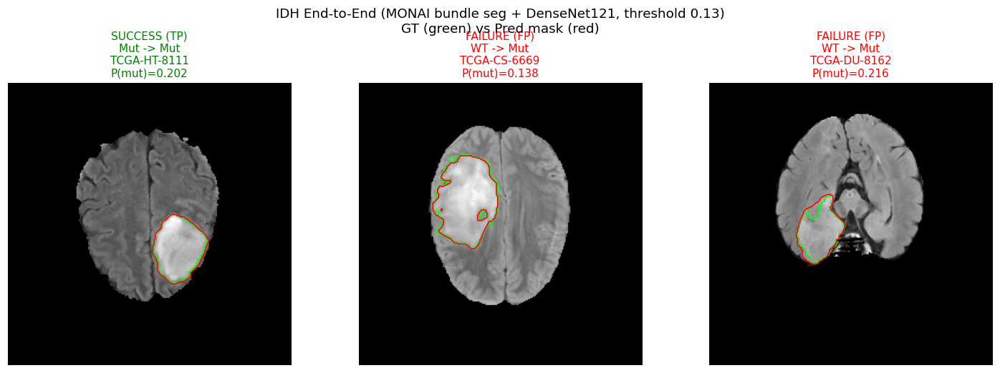

> 端到端推論：MONAI bundle 分割 → 以預測遮罩 bbox 裁切 ROI → DenseNet121 IDH 分類。操作閾值 **0.13**（於 val 以 macro-F1 選出，`artifacts/e2e_idh_config.json`）。綠線 = GT 遮罩，紅線 = 預測遮罩。標題綠色 = IDH 判讀正確、紅色 = 錯誤。

**Test 10 cases 完整結果**（閾值 0.13，依 P(mutant) 由高到低）：

| 案例 | 真實 | P(mutant) | 預測 | seg Dice | 結果 |
|------|------|-----------|------|----------|------|
| TCGA-DU-7301 | Mut(1) | 0.423 | Mut(1) | 0.959 | ✅ TP |
| TCGA-DU-A6S8 | Mut(1) | 0.396 | Mut(1) | 0.879 | ✅ TP |
| TCGA-FG-7634 | Mut(1) | 0.336 | Mut(1) | 0.952 | ✅ TP |
| TCGA-DU-7304 | Mut(1) | 0.244 | Mut(1) | 0.883 | ✅ TP |
| TCGA-DU-8162 | WT(0) | 0.216 | Mut(1) | 0.886 | ❌ FP |
| TCGA-HT-A61A | Mut(1) | 0.204 | Mut(1) | 0.923 | ✅ TP |
| TCGA-HT-8111 | Mut(1) | 0.202 | Mut(1) | 0.953 | ✅ TP |
| TCGA-CS-4944 | Mut(1) | 0.196 | Mut(1) | 0.958 | ✅ TP |
| TCGA-CS-5393 | Mut(1) | 0.192 | Mut(1) | 0.912 | ✅ TP |
| TCGA-CS-6669 | WT(0) | 0.138 | Mut(1) | 0.948 | ❌ FP |

> Test 混淆：TP 8、FP 2、TN 0、FN 0 → **Accuracy 0.80、AUC 0.75**、mutant recall 8/8 = **1.00**、WT recall 0/2 = **0.00**。在 0.13 這個高敏感操作點上，10 例的 P(mutant) 全數 > 0.13，故全判 Mut：8 個真突變全中（recall 1.0），但 2 個野生型（DU-8162 P=0.216、CS-6669 P=0.138）被推過閾值成偽陽性。**分割 Dice 仍高（0.88–0.96）卻無法救回 WT**——瓶頸在 IDH 分類頭對 WT 的低特異度，而非分割品質。提高閾值（如 ~0.21）可救回 CS-6669 一例 TN，但同時把 P 較低的真突變推成 FN，整體 accuracy 不升反降，這是小樣本下閾值難以兩全的典型現象。

**Val 10 cases 完整結果**（同一閾值 0.13，依 P(mutant) 由高到低）：

| 案例 | 真實 | P(mutant) | 預測 | seg Dice | 結果 |
|------|------|-----------|------|----------|------|
| TCGA-CS-4942 | Mut(1) | 1.000 | Mut(1) | 0.952 | ✅ TP |
| TCGA-HT-8563 | Mut(1) | 0.666 | Mut(1) | 0.965 | ✅ TP |
| TCGA-CS-6666 | Mut(1) | 0.552 | Mut(1) | 0.959 | ✅ TP |
| TCGA-DU-A5TU | Mut(1) | 0.338 | Mut(1) | 0.888 | ✅ TP |
| TCGA-DU-7306 | Mut(1) | 0.277 | Mut(1) | 0.892 | ✅ TP |
| TCGA-DU-5872 | Mut(1) | 0.204 | Mut(1) | 0.944 | ✅ TP |
| TCGA-DU-7302 | Mut(1) | 0.160 | Mut(1) | 0.911 | ✅ TP |
| TCGA-DU-8168 | Mut(1) | 0.133 | Mut(1) | 0.935 | ✅ TP |
| TCGA-DU-6404 | WT(0) | 0.124 | WT(0) | 0.960 | ✅ TN |
| TCGA-CS-6186 | WT(0) | 0.105 | WT(0) | 0.938 | ✅ TN |

> Val 混淆：TP 8、TN 2、FP 0、FN 0 → **Accuracy 1.00、AUC 1.00**（10 例全對；TCGA-CS-4942 高信心 P=1.000）。閾值正是在此 split 上選出的，故 val 完美分離（2 個 WT 的 P 皆 < 0.13）；test 落差到 0.80 反映 65-case 小樣本單一拆分的高變異——以 5-fold CV 衡量更穩健（下表）。

**5-fold 交叉驗證（3D DenseNet121，`scripts/cv_idh_monai.py`）**

| Fold | n_train / n_val | val 類別 (WT/Mut) | raw val AUC | smoothed AUC | best epoch |
|------|-----------------|-------------------|-------------|--------------|------------|
| 0 | 51 / 13 | 2 / 11 | 1.000 | 1.000 | 1 |
| 1 | 51 / 13 | 2 / 11 | 0.818 | 0.864 | 10 |
| 2 | 51 / 13 | 2 / 11 | 0.727 | 0.818 | 8 |
| 3 | 51 / 13 | 3 / 10 | 0.900 | 0.900 | 30 |
| 4 | 52 / 12 | 2 / 10 | 1.000 | 1.000 | 8 |
| **平均** | | | 0.889 ± 0.106 | **0.916 ± 0.073** | |

> CV 平均 smoothed val AUC **0.916 ± 0.073**，較 2D（0.764）高 +0.15。每折 val 僅 12–13 例（其中 WT 僅 2–3 例），單一錯判即大幅擺動 AUC，這是 ±0.07 變異的來源；smoothed（取訓練後期數個 epoch 的滑動平均）比 raw（±0.106）穩定許多，故以 smoothed 為報告值。

---

## 5. 推論結果圖 — Segmentation

### ✅ 成功案例 — MONAI Model Zoo bundle（3D）

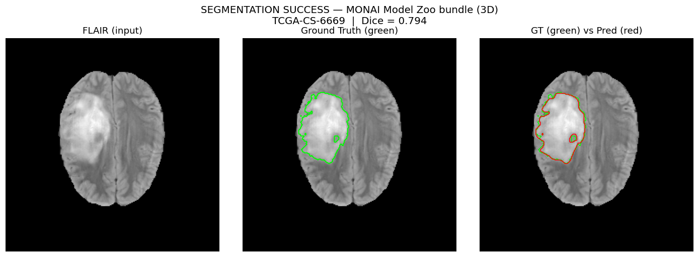

> **TCGA-CS-6669 | Dice = 0.794**（此圖為端到端預測遮罩；該案例在純分割 MONAI 評估中 Dice 0.838）。
> 綠線 = Ground Truth，紅線 = 預測。兩者輪廓高度吻合，腫瘤主體與邊界皆精確捕捉。
> ⚠️ 注意：同一案例 CS-6669 **分割成功**（Dice 0.79/0.84）但 **IDH 端到端判讀失敗**（WT 被判成 Mut，P=0.138 > 閾值 0.13，見第 4 節）——印證「分割品質好 ≠ IDH 判讀正確」，下游分類頭才是端到端的瓶頸。

### 多案例推論藝廊 — MONAI Model Zoo bundle（3D，端到端遮罩）

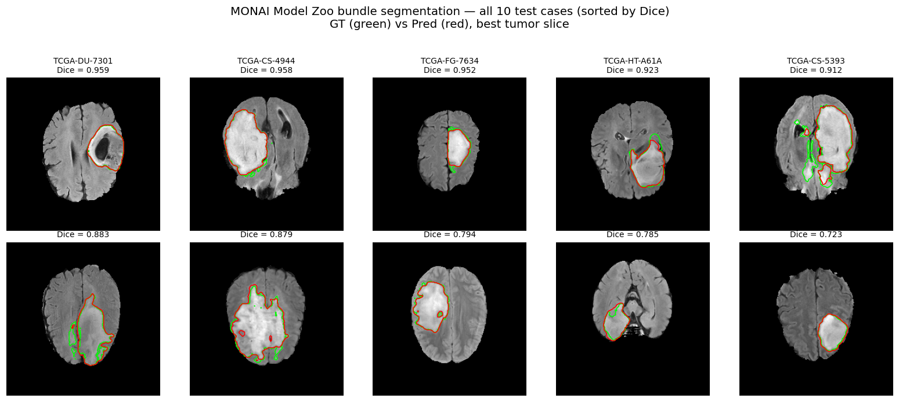

> 三個 test 案例的端到端預測遮罩（最佳腫瘤切片）。綠線 = GT、紅線 = 預測，輪廓在腫瘤主體上高度吻合。
> 圖中 Dice（0.72–0.79）為**端到端管線遮罩**之數值，略低於純分割 MONAI 評估（同案例 0.84–0.96，見下方對照表）——差距來自端到端 resample 與後處理差異，以及周邊切片的零星偽陽性（見下圖）。

### 體積一致性 — 跨切片逐層檢視（TCGA-HT-8111）

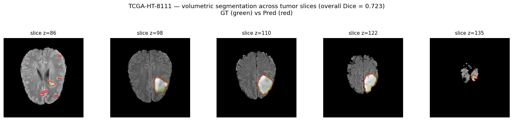

> 沿腫瘤的 5 個等距軸向切片。中段切片（z=98–122）GT 與預測幾乎完全重疊，邊界貼合；首切片（z=86）出現數個**零星偽陽性小斑**（散落紅圈），尾切片（z=135）僅殘餘極小區域。這正解釋了為何同一案例的端到端 Dice（0.723）低於純分割評估（0.955）——腫瘤主體分割優秀，Dice 損失主要來自周邊切片的少量假陽性體素，而非主體輪廓誤差。

### 誤差分解 — TP / FN / FP 並排（Dice 損失來源）

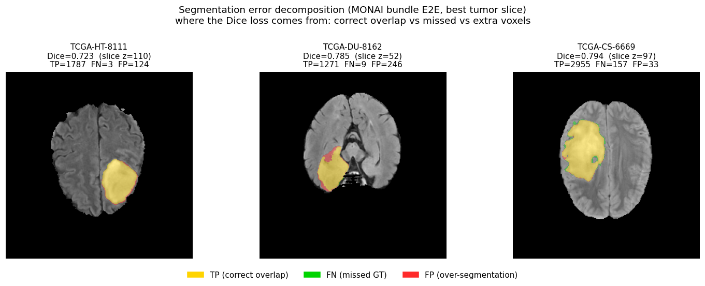

> 三個 E2E 案例在最佳腫瘤切片上的誤差分色：**黃 = TP（正確重疊）、綠 = FN（漏判 GT）、紅 = FP（過分割）**。把上一節「Dice 損失來自周邊偽陽性而非主體輪廓」的論述直接視覺化：
>
> | 案例 | Dice | TP | FN | FP | 主要誤差型態 |
> |------|------|----|----|----|--------------|
> | TCGA-HT-8111 | 0.723 | 1,787 | 3 | 124 | 主體幾近完美（最佳切片 FN 僅 3）；端到端 Dice 偏低來自**其他切片**的零星 FP（見上方逐層圖） |
> | TCGA-DU-8162 | 0.785 | 1,271 | 9 | 246 | **過分割**為主（左緣紅色），預測邊界略外擴 |
> | TCGA-CS-6669 | 0.794 | 2,955 | 157 | 33 | **漏判**為主（少量綠色），腫瘤主體仍精準捕捉 |
>
> 三例的 FN/FP 都遠小於 TP，主體輪廓皆精確；誤差型態各異（過分割 vs 漏判）但量級都很小，印證分割瓶頸不在主體而在邊緣的少數體素。

### 跨模態一致性 — 同一預測疊在 4 個輸入模態（TCGA-HT-8111）

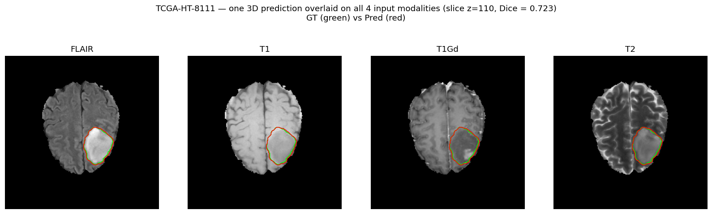

> 同一個 3D 預測（紅線）與 GT（綠線）疊在 **FLAIR / T1 / T1Gd / T2** 四個輸入模態的同一切片上。輪廓在四種模態上都貼合腫瘤邊界——代表模型鎖定的是**解剖結構**，而非單一模態的亮度特徵（例如 FLAIR 的高訊號水腫或 T1Gd 的強化環）。這也說明 4-channel 輸入提供了互補資訊，預測不會因任一模態對比較弱而崩潰。

### ❌ 失敗案例 — Legacy U-Net 2D

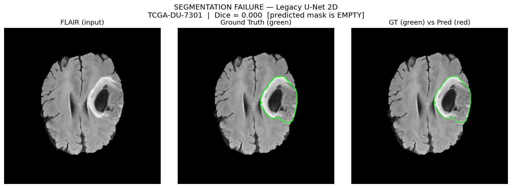

> **TCGA-DU-7301 | Dice = 0.000 — 預測遮罩為空**。
> 影像中央有明顯腫瘤（綠線標出 GT），但舊版 2D U-Net 在此 slice 幾何下**完全未偵測到任何腫瘤體素**（無紅線）。這正是改用 3D 架構的主因：2D 逐切片推論缺乏體積上下文，在非典型切片上會整片崩潰。

### 分割模型對照（test, 10 cases）

| 模型 | Dice mean ± std | min | max |
|------|------|------|------|
| U-Net 2D（legacy） | 0.760 ± 0.090 | — | — |
| SegResNet 3D（自訓） | 0.910 ± 0.036 | 0.838 | 0.964 |
| **Model Zoo bundle（zero-shot，推薦）** | **0.926 ± 0.031** | — | — |

逐案例 Dice（SegResNet 3D）：最佳 TCGA-DU-7301 = 0.964，最難 TCGA-CS-6669 = 0.838。

---

## 6. 結論與已知限制

**結論**
- **分類**：CT/MRI 腫瘤分類達 96.4% / AUC 0.993，生產可用；分子 IDH（RNA-seq）AUC 0.99 為各路徑最強。
- **分割**：MONAI Model Zoo bundle（zero-shot Dice 0.926）勝過自訓模型，列為生產推薦。
- **IDH 影像分類**：3D（CV AUC 0.916）顯著優於 2D（0.764）；端到端受分割誤差影響降至 AUC 0.75。

**已知限制**
- BraTS-TCGA-LGG 僅 65 cases，影像 IDH 分類樣本量小，CV 變異偏大（±0.07）。
- 端到端 IDH 錯誤多落在閾值附近，對 ROI 邊界誤差敏感。
- YOLO 偵測在現有資料量（~1,100 張）下飽和於 mAP50 ≈ 0.50，需更多資料而非更大 backbone。
- Legacy 2D U-Net 在非典型切片幾何下可能輸出空遮罩，不應用於生產。

---

### 附錄：重現本報告圖片
```bash
# 分割疊圖 + CT 分類蒙太奇（即時由 GT/預測遮罩繪製）
python3 scripts/_make_report_overlays.py        # → docs/report_assets/

# 重新產生評估圖
uv run eval-ct                 # CT 分類 ROC / 混淆矩陣
uv run eval-seg-monai          # 3D 分割 Dice 直方圖
uv run eval-e2e-zoo            # IDH 端到端 ROC / 混淆矩陣
uv run eval-idh-molecular --modalities rnaseq methylation  # 分子 IDH 圖
```
